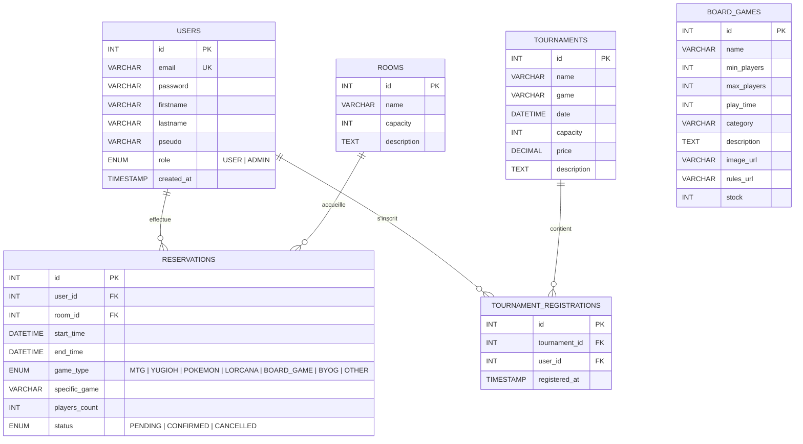

# 📘 Dossier de Conception — Cicados

> **Titre professionnel visé** : Développeur Web et Web Mobile (DWWM)  
> **Projet** : Cicados — Application web de réservation de tables de jeux et de gestion de tournois  
> **Stack technique** : React.js (Vite) + Node.js (Express) + MySQL  
> **Candidat** : *(à compléter)*  
> **Date** : Juillet 2026

---

## Table des matières

1. [Présentation du projet](#1--présentation-du-projet)
2. [Architecture technique](#2--architecture-technique)
   - 2.1 [Technologies utilisées](#technologies-utilisées)
   - 2.2 [Gestion des variables d'environnement (.env)](#22-gestion-des-variables-denvironnement-env)
3. [Structure des fichiers](#3--structure-des-fichiers)
4. [Base de données](#4--base-de-données)
5. [Backend — API REST Node.js / Express](#5--backend--api-rest-nodejs--express)
   - 5.1 [Point d'entrée du serveur](#51-point-dentrée-du-serveur-serverjs)
   - 5.2 [Configuration de la base de données](#52-configuration-de-la-base-de-données-srcconfigdbjs)
   - 5.3 [Architecture MVC](#53-architecture-mvc)
   - 5.4 [Authentification et sécurité (JWT)](#54-authentification-et-sécurité-jwt)
   - 5.5 [Middlewares de protection](#55-middlewares-de-protection)
   - 5.6 [Système de réservation avec détection de conflits](#56-système-de-réservation-avec-détection-de-conflits)
   - 5.7 [Gestion des tournois](#57-gestion-des-tournois)
   - 5.8 [Intégration et API Proxy de BoardGameGeek](#58-intégration-et-api-proxy-de-boardgamegeek)
   - 5.9 [Tolérance aux pannes et sauvegarde locale du catalogue](#59-tolérance-aux-pannes-et-sauvegarde-locale-du-catalogue)
   - 5.10 [Liste complète des Endpoints de l'API REST](#510-liste-complète-des-endpoints-de-lapi-rest)
6. [Frontend — React.js (Vite)](#6--frontend--reactjs-vite)
   - 6.1 [Point d'entrée et routage](#61-point-dentrée-et-routage)
   - 6.2 [Service API centralisé](#62-service-api-centralisé)
   - 6.3 [Internationalisation (i18n)](#63-internationalisation-i18n)
   - 6.4 [Page d'accueil](#64-page-daccueil)
   - 6.5 [Système de réservation interactif](#65-système-de-réservation-interactif)
   - 6.6 [Espace utilisateur « Mes Activités »](#66-espace-utilisateur--mes-activités-)
   - 6.7 [Catalogue de jeux de société](#67-catalogue-de-jeux-de-société)
   - 6.8 [Page des tournois](#68-page-des-tournois)
   - 6.9 [Tableau de bord administrateur](#69-tableau-de-bord-administrateur)
   - 6.10 [Navigation responsive (Hamburger Menu)](#610-navigation-responsive-hamburger-menu)
7. [Sécurité](#7--sécurité)
8. [Responsive Design](#8--responsive-design)
9. [Compétences mobilisées (REAC DWWM)](#9--compétences-mobilisées-reac-dwwm)

---

## 1 — Présentation du projet

**Cicados** est une application web complète développée pour un espace de jeu spécialisé dans les **jeux de cartes à collectionner (TCG)** et les **jeux de société**.

### Fonctionnalités principales

| Fonctionnalité | Description |
|---|---|
| 🔐 Authentification | Inscription, connexion, gestion de profil avec JWT |
| 📅 Réservation de table | Réservation en ligne avec planning interactif et détection de conflits |
| 🏆 Tournois | Inscription/désinscription aux tournois de TCG avec jauge de capacité |
| 🎲 Catalogue de jeux | Consultation d'un catalogue de 100+ jeux de société avec images et descriptions |
| 👤 Espace utilisateur | Consultation, modification et annulation de ses réservations/tournois |
| 🛡️ Dashboard admin | Gestion complète des utilisateurs, réservations, tournois et catalogue |
| 🌐 Internationalisation | Support bilingue français/anglais avec détection automatique |
| 📱 Responsive | Interface adaptative mobile/tablette/desktop avec menu hamburger |

---

## 2 — Architecture technique

L'application suit une **architecture client-serveur** avec séparation totale du frontend et du backend, communiquant exclusivement via une **API REST** :

```
┌──────────────────────────────────┐      ┌──────────────────────────────────┐
│          FRONTEND                │      │           BACKEND                │
│    React.js + Vite               │      │    Node.js + Express             │
│    Port : 5173 (dev)             │─────▶│    Port : 5050                   │
│                                  │ HTTP │                                  │
│  ● Pages React (JSX)             │ REST │  ● API REST (JSON)               │
│  ● Tailwind CSS                  │      │  ● Architecture MVC              │
│  ● React Router                  │      │  ● JWT pour l'auth               │
│  ● i18next (traduction)          │      │  ● mysql2 (pool de connexions)   │
└──────────────────────────────────┘      └──────────────┬───────────────────┘
                                                         │
                                                         ▼
                                          ┌──────────────────────────────────┐
                                          │         BASE DE DONNÉES          │
                                          │           MySQL 5.7+             │
                                          │         Base : cicados           │
                                          │                                  │
                                          │  ● users                         │
                                          │  ● rooms                         │
                                          │  ● reservations                  │
                                          │  ● tournaments                   │
                                          │  ● tournament_registrations      │
                                          │  ● board_games                   │
                                          └──────────────────────────────────┘
```

### Technologies utilisées

| Couche | Technologie | Version | Rôle |
|---|---|---|---|
| Frontend | React.js | 18+ | Interface utilisateur composants |
| Bundler | Vite | 5+ | Serveur de développement et build |
| Styles | Tailwind CSS | 3+ | Framework CSS utilitaire |
| Routing | React Router | 6+ | Navigation SPA côté client |
| Traduction | i18next | — | Internationalisation FR/EN |
| Backend | Node.js | 20+ | Runtime JavaScript serveur |
| Framework API | Express | 5+ | Gestion des routes HTTP REST |
| Auth | jsonwebtoken (JWT) | 9+ | Tokens d'authentification |
| Hash | bcrypt | 6+ | Hashage des mots de passe |
| BDD | MySQL | 5.7+ | Base de données relationnelle |
| Driver BDD | mysql2 | 3+ | Pool de connexions async |
| Email | Brevo (Sendinblue) | — | Envoi d'emails transactionnels |
| Validation | Zod | 4+ | Validation de schémas côté serveur |


### 2.2 Gestion des variables d'environnement (`.env`)

Pour sécuriser l'application et séparer la configuration du code source, les informations sensibles (identifiants de base de données, secrets cryptographiques) sont externalisées dans un fichier `.env` à la racine du dossier `backend/`. Ce fichier est exclu du dépôt de code (via `.gitignore`) pour des raisons évidentes de sécurité.

**Exemple de structure de fichier `.env` :**
```env
PORT=5050
DB_HOST=localhost
DB_PORT=3306
DB_USER=root
DB_PASSWORD=root
DB_NAME=cicados
JWT_SECRET=super_secret_cle_signature_jwt_987654321
```

**Chargement et accès en JavaScript :**
Grâce au package `dotenv` configuré au point d'entrée (`import 'dotenv/config';` dans `server.js`), ces variables sont chargées dans l'objet système global `process.env` au lancement du serveur :
```javascript
// Accès aux variables d'environnement
const dbConfig = {
    host: process.env.DB_HOST || 'localhost',
    user: process.env.DB_USER,
    password: process.env.DB_PASSWORD,
    database: process.env.DB_NAME
};
```

---

## 3 — Structure des fichiers

```
Cicadas2/
├── backend/
│   ├── server.js                          # Point d'entrée Express
│   ├── schema.sql                         # Script de création de la BDD
│   ├── package.json                       # Dépendances backend
│   ├── .env                               # Variables d'environnement (non versionné)
│   ├── scripts/
│   │   └── import-bgg-hot.js              # Script d'import BGG avec traduction
│   └── src/
│       ├── config/
│       │   └── db.js                      # Pool MySQL + migrations auto
│       ├── controllers/
│       │   ├── auth.controller.js         # Inscription, connexion, profil
│       │   ├── reservation.controller.js  # CRUD réservations
│       │   ├── tournament.controller.js   # Tournois + inscriptions
│       │   ├── admin.controller.js        # Actions administrateur
│       │   ├── boardgame.controller.js    # Consultation catalogue
│       │   ├── bgg.controller.js          # Recherche BoardGameGeek
│       │   └── email.controller.js        # Envoi d'emails via Brevo
│       ├── models/
│       │   ├── user.model.js              # Modèle User (CRUD + bcrypt)
│       │   ├── reservation.model.js       # Modèle Reservation (conflits)
│       │   ├── tournament.model.js        # Modèle Tournament (inscriptions)
│       │   └── boardgame.model.js         # Modèle BoardGame (catalogue)
│       ├── middlewares/
│       │   ├── auth.middleware.js          # Vérification JWT
│       │   └── admin.middleware.js         # Vérification rôle ADMIN
│       ├── routes/
│       │   ├── auth.routes.js             # POST /register, /login, GET /me
│       │   ├── reservation.routes.js      # GET, POST, PUT, DELETE
│       │   ├── tournament.routes.js       # GET, POST, DELETE + inscription
│       │   ├── admin.routes.js            # Routes protégées admin
│       │   ├── boardgame.routes.js        # GET /boardgames
│       │   ├── bgg.routes.js              # Proxy vers BoardGameGeek
│       │   └── email.routes.js            # POST /email/send
│       ├── services/                      # Services métier
│       └── data/
│           └── boardgame-list.json        # Données JSON de jeux de société
│
├── frontend/
│   ├── package.json                       # Dépendances frontend
│   ├── vite.config.js                     # Configuration Vite
│   ├── index.html                         # Point d'entrée HTML
│   ├── public/
│   │   ├── locales/
│   │   │   ├── fr/translation.json        # Traductions françaises
│   │   │   └── en/translation.json        # Traductions anglaises
│   │   └── assets/img/                    # Images statiques
│   └── src/
│       ├── main.jsx                       # Bootstrap React + i18n
│       ├── App.jsx                        # Routeur principal
│       ├── index.css                      # Styles globaux
│       ├── i18n.js                        # Configuration i18next
│       ├── services/
│       │   └── api.js                     # Service HTTP centralisé
│       ├── components/
│       │   ├── Header.jsx                 # Barre de navigation (responsive)
│       │   └── Footer.jsx                 # Pied de page
│       ├── layouts/
│       │   └── MainLayout.jsx             # Layout global (Header + Footer)
│       └── pages/
│           ├── Home.jsx                   # Page d'accueil (carrousel, FAQ)
│           ├── Login.jsx                  # Page de connexion
│           ├── Register.jsx               # Page d'inscription
│           ├── Reservations.jsx           # Formulaire + planning interactif
│           ├── MyReservations.jsx         # Espace "Mes Activités"
│           ├── BoardGames.jsx             # Catalogue de jeux de société
│           ├── Tournaments.jsx            # Liste et inscription tournois
│           └── DashboardAdmin.jsx         # Tableau de bord admin
│
└── package.json                           # Script racine (concurrently)
```

---

## 4 — Base de données

### Modèle Conceptuel de Données (MCD)



### Script de création (`schema.sql`)

Le fichier `schema.sql` contient la structure de base. Au démarrage du serveur, la fonction `testConnection()` dans `db.js` effectue des **migrations automatiques** pour ajouter les colonnes manquantes et les tables supplémentaires (tournois, jeux de société, etc.) :

```sql
-- Création de la base
CREATE DATABASE IF NOT EXISTS cicados
CHARACTER SET utf8mb4 COLLATE utf8mb4_unicode_ci;

-- Table des utilisateurs
CREATE TABLE IF NOT EXISTS users (
    id INT UNSIGNED AUTO_INCREMENT PRIMARY KEY,
    email VARCHAR(255) NOT NULL UNIQUE,
    password VARCHAR(255) NOT NULL,
    firstname VARCHAR(100),
    lastname VARCHAR(100),
    pseudo VARCHAR(100) DEFAULT NULL,
    created_at TIMESTAMP DEFAULT CURRENT_TIMESTAMP,
    INDEX idx_email (email)
) ENGINE=InnoDB;

-- Table des salles de jeu
CREATE TABLE IF NOT EXISTS rooms (
    id INT UNSIGNED AUTO_INCREMENT PRIMARY KEY,
    name VARCHAR(100) NOT NULL,
    capacity INT UNSIGNED NOT NULL,
    description TEXT
) ENGINE=InnoDB;

-- Table des réservations
CREATE TABLE IF NOT EXISTS reservations (
    id INT UNSIGNED AUTO_INCREMENT PRIMARY KEY,
    user_id INT UNSIGNED NOT NULL,
    room_id INT UNSIGNED NOT NULL,
    start_time DATETIME NOT NULL,
    end_time DATETIME NOT NULL,
    game_type ENUM('MTG','YUGIOH','POKEMON','LORCANA','BOARD_GAME','BYOG','OTHER'),
    specific_game VARCHAR(255) DEFAULT NULL,
    players_count INT UNSIGNED DEFAULT 2,
    status ENUM('PENDING','CONFIRMED','CANCELLED') DEFAULT 'PENDING',
    FOREIGN KEY (user_id) REFERENCES users(id) ON DELETE CASCADE,
    FOREIGN KEY (room_id) REFERENCES rooms(id) ON DELETE CASCADE,
    INDEX idx_reservation_times (start_time, end_time)
) ENGINE=InnoDB;

-- Table des jeux de société
CREATE TABLE IF NOT EXISTS board_games (
    id INT UNSIGNED AUTO_INCREMENT PRIMARY KEY,
    name VARCHAR(255) NOT NULL,
    min_players INT UNSIGNED NOT NULL DEFAULT 1,
    max_players INT UNSIGNED NOT NULL DEFAULT 4,
    play_time INT UNSIGNED NOT NULL DEFAULT 30,
    category VARCHAR(100) NOT NULL DEFAULT 'Stratégie',
    description TEXT,
    image_url VARCHAR(500) DEFAULT NULL,
    rules_url VARCHAR(500) DEFAULT NULL,
    stock INT UNSIGNED NOT NULL DEFAULT 1,
    created_at TIMESTAMP DEFAULT CURRENT_TIMESTAMP
) ENGINE=InnoDB;
```

> **Choix technique** : L'utilisation de `FOREIGN KEY ... ON DELETE CASCADE` garantit l'intégrité référentielle. Si un utilisateur est supprimé, toutes ses réservations et inscriptions aux tournois le sont aussi.

---

## 5 — Backend — API REST Node.js / Express

### 5.1 Point d'entrée du serveur (`server.js`)

Le fichier `server.js` est le point d'entrée de l'API. Il initialise Express, configure les middlewares globaux, et monte les routes :

```javascript
// server.js
import 'dotenv/config';
import express from 'express';
import cors from 'cors';
import { testConnection } from './src/config/db.js';

const app = express();
const PORT = process.env.PORT || 5000;

// Connexion BDD (+ migrations automatiques)
testConnection();

// Middlewares
app.use(cors({
    origin: (origin, callback) => {
        if (!origin || origin.startsWith('http://localhost')) {
            callback(null, true);
        } else {
            callback(new Error('Non autorisé par CORS'));
        }
    },
    credentials: true
}));
app.use(express.json());

// Routes
app.use('/api/auth', authRoutes);
app.use('/api/reservations', reservationRoutes);
app.use('/api/tournaments', tournamentRoutes);
app.use('/api/admin', adminRoutes);
app.use('/api/boardgames', boardgameRoutes);
app.use('/api/bgg', bggRoutes);
app.use('/api/email', emailRoutes);

// 404
app.use((req, res) => res.status(404).json({ error: 'Route non trouvée' }));

app.listen(PORT, () => {
    console.log(`Serveur sur http://localhost:${PORT}`);
});
```

**Points techniques importants :**
- **CORS dynamique** : Seules les origines `localhost` sont autorisées, ce qui protège contre les requêtes cross-origin non désirées.
- **`dotenv/config`** : Les variables sensibles (clés JWT, identifiants BDD) sont chargées depuis `.env` et jamais codées en dur.
- **`testConnection()`** : À chaque démarrage, la BDD est vérifiée et les migrations automatiques sont exécutées.

---

### 5.2 Configuration de la base de données (`src/config/db.js`)

Ce fichier centralise la connexion MySQL et les migrations automatiques :

```javascript
import mysql from 'mysql2/promise';

// Création d'un pool de connexions (jusqu'à 10 simultanées)
const pool = mysql.createPool({
    host: process.env.DB_HOST || 'localhost',
    port: parseInt(process.env.DB_PORT || '3306', 10),
    user: process.env.DB_USER || 'root',
    password: process.env.DB_PASSWORD || '',
    database: process.env.DB_NAME || 'cicados',
    waitForConnections: true,
    connectionLimit: 10
});

// Fonction utilitaire pour les requêtes (requêtes paramétrées)
export async function query(sql, params = []) {
    const [results] = await pool.execute(sql, params);
    return results;
}
```

**Pourquoi un pool de connexions ?**  
Un **pool** (`mysql.createPool`) maintient un ensemble de connexions réutilisables prêtes à l'emploi. Contrairement à `createConnection()` qui ouvre une connexion unique, le pool peut gérer jusqu'à 10 requêtes simultanées. Quand une requête est terminée, la connexion retourne dans le pool au lieu d'être fermée.

**Pourquoi `pool.execute()` et non `pool.query()` ?**  
La méthode `execute()` utilise des **requêtes préparées** (prepared statements). Les paramètres sont envoyés séparément de la requête SQL, ce qui **protège contre les injections SQL** :

```javascript
// ✅ Sécurisé — Paramètres échappés automatiquement
const results = await query('SELECT * FROM users WHERE email = ?', [email]);

// ❌ Dangereux — Injection SQL possible
const results = await query(`SELECT * FROM users WHERE email = '${email}'`);
```

#### Migrations automatiques au démarrage

La fonction `testConnection()` vérifie et crée automatiquement les colonnes ou tables manquantes. Cela garantit que la base de données est toujours à jour sans intervention manuelle :

```javascript
export async function testConnection() {
    const connection = await pool.getConnection();
    console.log('MySQL connecté');

    // Vérifier si la colonne 'role' existe sur 'users'
    const [cols] = await connection.execute("SHOW COLUMNS FROM users LIKE 'role'");
    if (cols.length === 0) {
        await connection.execute(
            "ALTER TABLE users ADD COLUMN role ENUM('USER','ADMIN') DEFAULT 'USER'"
        );
        console.log("Colonne 'role' ajoutée à la table users");
    }

    // Créer l'administrateur par défaut s'il n'existe pas
    const [adminRows] = await connection.execute(
        "SELECT * FROM users WHERE email = 'admin@cicados.fr'"
    );
    if (adminRows.length === 0) {
        const bcrypt = await import('bcrypt');
        const hashedPassword = await bcrypt.default.hash('admincicados', 10);
        await connection.execute(
            "INSERT INTO users (email, password, firstname, lastname, role) " +
            "VALUES ('admin@cicados.fr', ?, 'Admin', 'Cicados', 'ADMIN')",
            [hashedPassword]
        );
    }

    // Créer la table des tournois si inexistante
    await connection.execute(`
        CREATE TABLE IF NOT EXISTS tournaments (
            id INT UNSIGNED AUTO_INCREMENT PRIMARY KEY,
            name VARCHAR(255) NOT NULL,
            game VARCHAR(100) NOT NULL,
            date DATETIME NOT NULL,
            capacity INT UNSIGNED NOT NULL,
            price DECIMAL(10,2) NOT NULL DEFAULT 0.00,
            description TEXT,
            created_at TIMESTAMP DEFAULT CURRENT_TIMESTAMP
        ) ENGINE=InnoDB;
    `);

    connection.release();
}
```

**Points clés :**
- Le mot de passe admin est **hashé avec bcrypt** (10 rounds de salage) avant insertion.
- `connection.release()` restitue la connexion au pool après utilisation.
- `CREATE TABLE IF NOT EXISTS` et `SHOW COLUMNS FROM ... LIKE` sont **idempotents** : ils ne font rien si la structure existe déjà.

---

### 5.3 Architecture MVC

Le backend suit le patron de conception **MVC (Modèle-Vue-Contrôleur)** :

```
Requête HTTP
     │
     ▼
┌─────────────┐     ┌──────────────────┐     ┌─────────────────┐
│   ROUTES    │────▶│   CONTROLLERS    │────▶│     MODELS      │
│  (Routeur)  │     │  (Logique app)   │     │   (Requêtes SQL)│
│             │     │                  │     │                 │
│ Définit URL │     │ Valide les       │     │ Exécute les     │
│ et méthode  │     │ entrées,         │     │ requêtes sur la │
│ HTTP        │     │ gère les erreurs │     │ base de données │
└─────────────┘     └──────────────────┘     └─────────────────┘
```

**Exemple concret — Flux d'une création de réservation :**

1. **Route** (`reservation.routes.js`) : reçoit `POST /api/reservations` et appelle le middleware d'authentification, puis le contrôleur.

```javascript
// routes/reservation.routes.js
import { Router } from 'express';
import { createReservation } from '../controllers/reservation.controller.js';
import authMiddleware from '../middlewares/auth.middleware.js';

const router = Router();
router.post('/', authMiddleware, createReservation);
export default router;
```

2. **Contrôleur** (`reservation.controller.js`) : valide les données, appelle le modèle, et retourne la réponse HTTP.

```javascript
// controllers/reservation.controller.js
export const createReservation = async (req, res) => {
    try {
        const { gameType, date, time, duration, specificGame, playersCount } = req.body;
        const userId = req.user.id;  // ← Injecté par authMiddleware

        if (!date || !time || !duration) {
            return res.status(400).json({ error: 'Remplissez le formulaire en entier' });
        }

        const reservation = await Reservation.create({
            user_id: userId, date, time, duration, gameType,
            specific_game: specificGame,
            players_count: playersCount ? parseInt(playersCount, 10) : 2
        });

        res.status(201).json({ message: 'Réservation réussie !', reservation });
    } catch (error) {
        if (error.message && error.message.includes("complètes")) {
            return res.status(400).json({ error: error.message });
        }
        res.status(500).json({ error: 'Erreur serveur interne.' });
    }
};
```

3. **Modèle** (`reservation.model.js`) : il contient la logique SQL et métier pure de l'application, utilisant des requêtes préparées pour la sécurité :

```javascript
// models/reservation.model.js
import { query } from '../config/db.js';

const Reservation = {
    // Récupérer toutes les réservations d'un utilisateur
    async findByUserId(userId) {
        const sql = `
            SELECT r.*, rm.name as tableName 
            FROM reservations r
            JOIN rooms rm ON r.room_id = rm.id
            WHERE r.user_id = ?
            ORDER BY r.start_time DESC
        `;
        return query(sql, [userId]);
    },

    // Supprimer (Annuler) une réservation
    async delete(id, userId) {
        const sql = `DELETE FROM reservations WHERE id = ? AND user_id = ?`;
        return query(sql, [id, userId]);
    }
};
export default Reservation;
```

---

### 5.4 Authentification et sécurité (JWT)

L'authentification repose sur le standard **JSON Web Token (JWT)** :

```
  ┌─────────┐              ┌─────────┐              ┌─────────┐
  │ Client  │──── POST ───▶│ Serveur │──── SELECT ──▶│  MySQL  │
  │ (React) │  /api/auth/  │(Express)│  FROM users   │         │
  │         │   login      │         │◀── résultat ──│         │
  │         │◀── Token ────│         │               │         │
  │         │   JWT        │         │               │         │
  │         │              │         │               │         │
  │         │── GET ───────▶         │               │         │
  │         │ /api/reserv. │         │               │         │
  │         │ Authorization│         │               │         │
  │         │ Bearer <JWT> │         │               │         │
  └─────────┘              └─────────┘              └─────────┘
```

#### Inscription (`POST /api/auth/register`)

```javascript
// controllers/auth.controller.js
export const register = async (req, res) => {
    const { email, password, firstname, lastname, pseudo } = req.body;
    
    // 1. Vérification des champs obligatoires
    if (!email || !password) {
        return res.status(400).json({ error: 'Email et mot de passe requis' });
    }
    
    // 2. Vérification de l'unicité de l'email
    const existingUser = await User.findByEmail(email);
    if (existingUser) {
        return res.status(409).json({ error: 'Email déjà utilisé' });
    }
    
    // 3. Hashage du mot de passe + insertion en BDD
    const user = await User.create({ email, password, firstname, lastname, pseudo });
    
    // 4. Génération du token JWT
    const token = generateToken(user);
    res.status(201).json({ message: 'Inscription réussie', user, token });
};
```

#### Hashage du mot de passe (modèle `User`)

Le mot de passe n'est **jamais stocké en clair** dans la base de données. La librairie `bcrypt` applique un **salage** de 10 rounds qui rend chaque hash unique, même pour des mots de passe identiques :

```javascript
// models/user.model.js
import bcrypt from 'bcrypt';

const User = {
    async create({ email, password, firstname, lastname, pseudo }) {
        // Hashage avec 10 rounds de salage
        const hashedPassword = await bcrypt.hash(password, 10);
        const sql = `INSERT INTO users (email, password, firstname, lastname, pseudo)
                     VALUES (?, ?, ?, ?, ?)`;
        const result = await query(sql, [
            email.toLowerCase(), hashedPassword, firstname, lastname, pseudo
        ]);
        return { id: result.insertId, email, firstname, lastname, pseudo };
    },

    async verifyPassword(plainPassword, hashedPassword) {
        return bcrypt.compare(plainPassword, hashedPassword);
    }
};
```

#### Génération du token JWT

```javascript
const generateToken = (user) => {
    return jwt.sign(
        { id: user.id, email: user.email },  // Payload (données encodées)
        process.env.JWT_SECRET,               // Clé secrète (dans .env)
        { expiresIn: '7d' }                   // Durée de validité : 7 jours
    );
};
```

Le token JWT contient l'identifiant et l'email de l'utilisateur. Il est signé avec une clé secrète stockée dans `.env`, et expire automatiquement après 7 jours.

---

### 5.5 Middlewares de protection

#### Middleware d'authentification (`auth.middleware.js`)

Ce middleware intercepte **toutes les requêtes protégées** et vérifie la validité du token JWT :

```javascript
// middlewares/auth.middleware.js
import jwt from 'jsonwebtoken';
import User from '../models/user.model.js';

const authMiddleware = async (req, res, next) => {
    try {
        // 1. Extraire le token du header "Authorization: Bearer <token>"
        const authHeader = req.headers.authorization;
        if (!authHeader || !authHeader.startsWith('Bearer ')) {
            return res.status(401).json({ error: 'Token manquant' });
        }
        const token = authHeader.split(' ')[1];

        // 2. Vérifier et décoder le token
        const decoded = jwt.verify(token, process.env.JWT_SECRET);

        // 3. Charger l'utilisateur depuis la BDD
        const user = await User.findById(decoded.id);
        if (!user) {
            return res.status(401).json({ error: 'Utilisateur non trouvé' });
        }

        // 4. Injecter l'utilisateur dans la requête pour les contrôleurs
        req.user = user;
        next();  // ← Passe au contrôleur suivant
    } catch (error) {
        if (error.name === 'TokenExpiredError') {
            return res.status(401).json({ error: 'Token expiré' });
        }
        return res.status(401).json({ error: 'Token invalide' });
    }
};
```

**Fonctionnement pas à pas :**
1. Le client envoie le token dans le header HTTP `Authorization: Bearer eyJhbGci...`
2. Le middleware extrait le token, le décode et vérifie sa signature.
3. Si le token est valide, l'utilisateur complet est chargé depuis la BDD et injecté dans `req.user`.
4. Si le token est expiré ou invalide, une erreur 401 est renvoyée.

#### Middleware d'administration (`admin.middleware.js`)

Ce middleware vérifie que l'utilisateur authentifié possède le rôle `ADMIN` :

```javascript
// middlewares/admin.middleware.js
const adminMiddleware = (req, res, next) => {
    if (!req.user || req.user.role !== 'ADMIN') {
        return res.status(403).json({
            error: "Accès refusé. Réservé aux administrateurs."
        });
    }
    next();
};
```

> **Chaînage des middlewares** : Les routes admin utilisent les deux middlewares en séquence :  
> `router.get('/users', authMiddleware, adminMiddleware, getAllUsers);`  
> D'abord on vérifie que l'utilisateur est connecté (`authMiddleware`), puis qu'il est admin (`adminMiddleware`).

---

### 5.6 Système de réservation avec détection de conflits

C'est la fonctionnalité **la plus complexe** du backend. Le modèle `Reservation` gère automatiquement :
1. L'attribution de table disponible
2. La détection de chevauchement de créneaux horaires
3. Le calcul de l'heure de fin à partir de la durée

```javascript
// models/reservation.model.js
const Reservation = {
    async create({ user_id, date, time, duration, gameType, specific_game, players_count }) {
        
        // 1. Vérifier qu'il y a au moins 4 tables de jeux
        let rooms = await query('SELECT id FROM rooms');
        if (rooms.length < 4) {
            // Créer les 4 tables par défaut
            await query(`
                INSERT INTO rooms (name, capacity, description) VALUES 
                ('Table 1 (TCG)', 4, 'Table parfaite pour les TCG'),
                ('Table 2 (TCG)', 4, 'Table dédiée aux duels de cartes'),
                ('Table 3 (Jeux de Société)', 6, 'Grande table pour jeux de plateau'),
                ('Table 4 (Jeux de Société)', 6, 'Grande table pour jeux de plateau')
            `);
            rooms = await query('SELECT id FROM rooms');
        }

        // 2. Calculer l'heure de fin (start_time + durée)
        const startTime = `${date} ${time}:00`;
        const startObj = new Date(startTime);
        startObj.setHours(startObj.getHours() + parseInt(duration, 10));
        // Formatage manuel pour MySQL (YYYY-MM-DD HH:MM:SS)
        const endTime = `${startObj.getFullYear()}-${String(startObj.getMonth()+1)
            .padStart(2,'0')}-${String(startObj.getDate()).padStart(2,'0')} ` +
            `${String(startObj.getHours()).padStart(2,'0')}:${String(startObj.getMinutes())
            .padStart(2,'0')}:00`;

        // 3. Détecter les tables OCCUPÉES pendant ce créneau
        const sqlOccupied = `
            SELECT room_id FROM reservations 
            WHERE start_time < ? AND end_time > ? AND status != 'CANCELLED'
        `;
        const occupiedRooms = await query(sqlOccupied, [endTime, startTime]);
        const occupiedIds = occupiedRooms.map(r => r.room_id);

        // 4. Trouver la première table DISPONIBLE
        const availableRoom = rooms.find(r => !occupiedIds.includes(r.id));
        if (!availableRoom) {
            throw new Error("Toutes les tables sont complètes pour ce créneau.");
        }

        // 5. Insérer la réservation sur la table disponible
        const sql = `
            INSERT INTO reservations 
            (user_id, room_id, start_time, end_time, game_type, status, specific_game, players_count)
            VALUES (?, ?, ?, ?, ?, 'CONFIRMED', ?, ?)
        `;
        const result = await query(sql, [
            user_id, availableRoom.id, startTime, endTime, 
            safeGameType, specific_game, players_count
        ]);
        return { id: result.insertId };
    }
};
```

**Algorithme de détection de conflits :**

La condition SQL `WHERE start_time < ? AND end_time > ?` détecte tous les chevauchements possibles entre deux créneaux horaires :

```
Créneau existant :   |===== 14:00 → 16:00 =====|
Nouveau créneau :         |=== 15:00 → 17:00 ===|
                          ↑ Conflit détecté !

Créneau existant :   |===== 14:00 → 16:00 =====|
Nouveau créneau :                                    |=== 17:00 → 19:00 ===|
                                                     ↑ Pas de conflit
```

---

#### 💡 Ajout de la validation des horaires antérieurs (Correctif Conception)

**Ce qui manquait initialement :**
Dans la première phase de conception, aucune validation n'empêchait un utilisateur de réserver une table à des **dates ou heures passées** (par exemple, réserver pour hier ou pour ce matin). L'absence de ce contrôle posait plusieurs problèmes :
1. **Intégrité temporelle** : L'API backend acceptait la création et la modification de réservations dans le passé sans lever d'erreur.
2. **Expérience utilisateur (UX)** : Sur le planning interactif, les boutons d'horaires déjà expirés pour le jour même apparaissaient disponibles (en vert) et cliquables.

**Code problématique initial (Sans contrôle temporel) :**
```javascript
// backend/src/controllers/reservation.controller.js
export const createReservation = async (req, res) => {
    try {
        const { gameType, date, time, duration, specificGame, playersCount } = req.body;
        const userId = req.user.id; 

        if (!date || !time || !duration) {
            return res.status(400).json({ error: 'Remplissez le formulaire en entier' });
        }

        // ❌ Le serveur ne comparait pas la date/heure demandée avec le temps actuel
        const reservation = await Reservation.create({
            user_id: userId,
            date,
            time,
            duration,
            gameType,
            specific_game: specificGame,
            players_count: playersCount
        });

        res.status(201).json({ message: 'Réservation réussie !', reservation });
    } catch (error) { ... }
};
```

**Solution et implémentation :**
1. **Sécurité Backend** : Ajout d'un contrôle dans `createReservation` et `updateReservation` (`reservation.controller.js`) comparant le timestamp de début de réservation au timestamp système actuel (`Date.now()`). Si le créneau est antérieur, l'API renvoie un statut `400 Bad Request` avec le message *"Impossible de réserver pour une date ou heure passée."*.

**Code corrigé avec validation stricte :**
```javascript
// backend/src/controllers/reservation.controller.js
if (new Date(`${date} ${time}:00`).getTime() < Date.now()) {
    // ✅ Bloque instantanément si l'horaire appartient au passé
    return res.status(400).json({ error: 'Impossible de réserver pour une date ou heure passée.' });
}
```

2. **Contrôle et Affichage Frontend** : 
   - Désactivation et apparence grisée des créneaux horaires passés dans le planning interactif (`Reservations.jsx`) si la date sélectionnée est aujourd'hui.
   - Initialisation dynamique du premier créneau sélectionné par défaut à la première heure disponible dans le futur (au lieu de 14h00 de manière statique).
   - Validation stricte avant soumission sur les formulaires de création (`Reservations.jsx`) et d'édition (`MyReservations.jsx`) pour interdire toute soumission d'horaires périmés.

---

### 5.7 Gestion du Stock Unique des Jeux et Réservation Temporelle en Temps Réel

L'une des évolutions clés du système réside dans la gestion fine du stock de chaque jeu de société physique :

1. **Règle de l'Exemplaire Unique (`stock = 1`)** :
   Chaque jeu de société présent en boutique est modélisé avec une quantité physique initiale de `1` (`stock INT DEFAULT 1`). Lorsqu'un client sélectionne un jeu spécifique (ex. : *Catan*) pour sa réservation de table, l'exemplaire est réservé pour le créneau choisi (ex. : 14h00 – 16h00).

2. **Désactivation Automatique des Créneaux Occupés (`Indisponible / Hors stock`)** :
   Sur la grille horaire de la page de réservation (`Reservations.jsx`), le serveur vérifie dynamiquement l'occupation temporelle de l'exemplaire via la condition SQL d'overlap :
   ```sql
   SELECT COUNT(*) as count FROM reservations 
   WHERE LOWER(TRIM(specific_game)) = LOWER(TRIM(?)) 
     AND start_time < ? AND end_time > ? 
     AND status != 'CANCELLED'
   ```
   Si l'exemplaire est déjà pris sur ce créneau, le bouton d'horaire affiche le badge **`Hors stock`** et devient automatiquement **inactivable** (`disabled`) pour le client.

3. **Restitution Automatique en Stock** :
   Dès que le créneau horaire est écoulé (`NOW() > end_time`) ou en cas d'annulation de la réservation, le jeu redevient instantanément sélectionnable pour de futures réservations.

4. **Contrôleur de Stock Admin en Direct (`+` / `-`)** :
   Sur le tableau de bord Administrateur (`DashboardAdmin.jsx`), un contrôleur interactif permet à l'administrateur d'augmenter ou de diminuer le stock en boutique en temps réel. Si le stock est passé à `0` (jeu retiré ou en réparation), la carte du jeu affiche le badge rouge **`INDISPONIBLE`** et bloque toute tentative de réservation.

5. **Consolidation en 6 Grandes Familles de Jeux** :
   Afin de simplifier la navigation et la recherche, les 53 sous-catégories ont été consolidées dans la BDD et l'interface en 6 grandes familles de référence :
   - 🎯 **Stratégie**
   - 👨‍👩‍👧‍👦 **Famille**
   - 🥳 **Ambiance**
   - 🤝 **Coopératif**
   - 🃏 **Cartes & Deckbuilding**
   - ⚙️ **Gestion**

6. **Règle de l'Image de Couverture Unique de Remplacement (Placeholder Unifié)** :
   Afin d'assurer une cohérence visuelle parfaite sur l'ensemble de l'application, les jeux disposant de leur couverture officielle BGG l'affichent en haute définition, tandis que tous les jeux dépourvus d'image personnalisée utilisent le même placeholder unifié de haute qualité (`https://images.unsplash.com/photo-1610890716171-6b1bb98ffd09?q=80&w=600`). Un gestionnaire d'erreur `onError` sur le frontend garantit qu'aucune image brisée ne s'affiche.

---

### 5.8 Gestion des tournois

Le modèle `Tournament` gère les inscriptions avec vérification de capacité et contrainte d'unicité :

```javascript
// models/tournament.model.js
const Tournament = {
    // Récupérer les tournois à venir avec le nombre d'inscrits
    async findAllUpcoming() {
        const sql = `
            SELECT t.*, COUNT(tr.id) as registeredCount
            FROM tournaments t
            LEFT JOIN tournament_registrations tr ON t.id = tr.tournament_id
            WHERE t.date >= NOW()
            GROUP BY t.id
            ORDER BY t.date ASC
        `;
        return query(sql);
    },

    // Inscrire un utilisateur (avec contrainte UNIQUE pour éviter les doublons)
    async register(tournamentId, userId) {
        const sql = `
            INSERT INTO tournament_registrations (tournament_id, user_id)
            VALUES (?, ?)
        `;
        return query(sql, [tournamentId, userId]);
    }
};
```

> **Contrainte UNIQUE** : La table `tournament_registrations` possède un index `UNIQUE KEY idx_tourney_user (tournament_id, user_id)` qui empêche un utilisateur de s'inscrire deux fois au même tournoi au niveau de la base de données.

---

### 5.8 Intégration et API Proxy de BoardGameGeek

Pour enrichir le catalogue de jeux de société de l'application sans saisie manuelle fastidieuse, le projet s'intègre avec l'API publique de **BoardGameGeek (BGG)**. 

#### Pourquoi un Proxy Backend pour BGG ?
Le frontend ne peut pas interroger directement l'API de BGG pour deux raisons fondamentales :
1. **CORS (Cross-Origin Resource Sharing)** : L'API de BoardGameGeek ne renvoie pas les en-têtes CORS requis, bloquant les requêtes directes depuis le navigateur (`localhost:5173`).
2. **Format de données** : BGG renvoie les données exclusivement au format **XML**. Faire le parsing XML ➔ JSON côté client alourdirait l'application frontend.

#### Implémentation du Proxy (`bgg.controller.js`)
Le contrôleur backend agit comme un relais HTTP. Il interroge l'API XML2 de BGG, convertit le flux XML reçu en objet JSON propre grâce à `fast-xml-parser`, puis renvoie le résultat au client.

```javascript
// controllers/bgg.controller.js
import { XMLParser } from 'fast-xml-parser';

const BGG_BASE_URL = 'https://boardgamegeek.com/xmlapi2';
const parser = new XMLParser({
    ignoreAttributes: false,
    attributeNamePrefix: '@_',
    allowBooleanAttributes: true
});

async function fetchBgg(endpoint, params = {}) {
    const queryParams = new URLSearchParams(params).toString();
    const url = `${BGG_BASE_URL}/${endpoint}?${queryParams}`;
    
    // Requête HTTP vers BGG
    const response = await fetch(url);
    if (!response.ok) {
        throw new Error(`BGG API returned status ${response.status}`);
    }
    
    const xmlData = await response.text();
    return xmlData;
}

export const searchGames = async (req, res) => {
    try {
        const { query } = req.query;
        const xml = await fetchBgg('search', { query, type: 'boardgame' });
        
        // Conversion XML vers JSON à la volée
        const json = parser.parse(xml);
        res.json(json);
    } catch (error) {
        res.status(500).json({ error: 'Erreur lors de la recherche sur BGG' });
    }
};
```

#### Script d'importation massive (`scripts/import-bgg-hot.js`)
En plus du proxy, un script d'importation en ligne de commande permet de charger automatiquement les 100 jeux de société les plus populaires du moment en boutique :
1. Le script interroge `/xmlapi2/hot?type=boardgame`.
2. Il parse le XML et extrait les identifiants uniques (BGG ID) des jeux.
3. Pour chaque identifiant, il effectue une requête de détails `/xmlapi2/thing?id=...` pour obtenir les images, les temps de jeux et le nombre de joueurs recommandés.
4. Les descriptions de jeux (en anglais à l'origine) sont soumises à une API de traduction afin d'alimenter la table `board_games` en français.


### 5.9 Tolérance aux pannes et sauvegarde locale du catalogue

Afin d'assurer la haute disponibilité de l'application, un mécanisme de tolérance aux pannes (**fault tolerance**) et de basculement (**failover**) a été mis en œuvre sur l'endpoint du catalogue de jeux de société (`/api/boardgames`).

#### Fonctionnement du mécanisme
1. **Source principale (Base de données)** : Le contrôleur tente d'abord de récupérer la liste complète des jeux de société stockés dans la base de données relationnelle via la méthode `BoardGame.findAll()`.
2. **Détection de la panne** : Si une panne survient sur la base de données (ex. : serveur MySQL arrêté, socket inaccessible, timeout), la promesse est rejetée et l'erreur est interceptée par le bloc `catch` du contrôleur.
3. **Activation de la sauvegarde locale (Relais JSON)** : À l'interception de l'erreur, le serveur bascule automatiquement sur la lecture asynchrone du fichier JSON local `/backend/src/data/boardgame-list.json`.
4. **Normalisation des données** : Les données du fichier JSON (qui ne contiennent à l'origine que les noms et IDs d'API des jeux) sont automatiquement enrichies et remappées à la volée avec des propriétés par défaut compatibles (nombre de joueurs fictifs, catégories et descriptions de secours) pour éviter tout crash d'affichage sur le catalogue ou le formulaire de réservation côté frontend.

#### Extrait de l'implémentation (`boardgame.controller.js`)
```javascript
export const getBoardGames = async (req, res) => {
    try {
        const games = await BoardGame.findAll();
        res.json(games);
    } catch (error) {
        console.error("Panne BDD détectée, basculement sur boardgame-list.json :", error);
        try {
            const jsonPath = path.join(__dirname, '..', 'data', 'boardgame-list.json');
            const data = await fs.readFile(jsonPath, 'utf8');
            const gamesList = JSON.parse(data);

            const fallbackGames = gamesList.map((game, index) => ({
                id: index + 10000,
                name: game.name,
                min_players: 2,
                max_players: 4,
                play_time: 45,
                category: "Famille",
                description: `Jeu de société : ${game.name}. (Données de secours chargées depuis le fichier local).`,
                image_url: 'https://images.unsplash.com/photo-1610890716171-6b1bb98ffd09?q=80&w=600',
                rules_url: null
            }));

            res.json(fallbackGames);
        } catch (jsonError) {
            res.status(500).json({ error: "Panne API principale et secours indisponible." });
        }
    }
};
```

### 5.10 Liste complète des Endpoints de l'API REST

Voici la liste ordonnée et documentée de tous les points d'accès exposés par le serveur Express du backend :

| Module | Méthode HTTP | URL de l'endpoint | Authentification | Rôle requis | Rôle / Utilité |
| :--- | :--- | :--- | :--- | :--- | :--- |
| **Auth** | `POST` | `/api/auth/register` | Aucune | — | Crée un compte utilisateur et retourne un token JWT. |
| **Auth** | `POST` | `/api/auth/login` | Aucune | — | Authentifie un utilisateur et retourne un token JWT. |
| **Auth** | `GET` | `/api/auth/me` | JWT | `USER` / `ADMIN` | Retourne les informations de profil de l'utilisateur connecté. |
| **Reservations** | `GET` | `/api/reservations/user` | JWT | `USER` / `ADMIN` | Récupère la liste des réservations de l'utilisateur connecté. |
| **Reservations** | `POST` | `/api/reservations` | JWT | `USER` / `ADMIN` | Crée une réservation de table avec allocation automatique. |
| **Reservations** | `PUT` | `/api/reservations/:id` | JWT | `USER` / `ADMIN` | Modifie une réservation (date, heure, jeu, joueurs). |
| **Reservations** | `DELETE` | `/api/reservations/:id` | JWT | `USER` / `ADMIN` | Annule définitivement une réservation de table. |
| **Reservations** | `GET` | `/api/reservations/availability` | Aucune | — | Récupère le taux d'occupation des tables pour une date. |
| **Reservations** | `GET` | `/api/reservations/game-availability` | Aucune | — | Vérifie si un jeu spécifique est réservé sur un créneau donné. |
| **Tournaments** | `GET` | `/api/tournaments` | Aucune | — | Récupère la liste de tous les tournois à venir. |
| **Tournaments** | `POST` | `/api/tournaments/:id/register` | JWT | `USER` / `ADMIN` | Inscrit l'utilisateur connecté à un tournoi. |
| **Tournaments** | `DELETE` | `/api/tournaments/:id/unregister` | JWT | `USER` / `ADMIN` | Désinscrit l'utilisateur connecté d'un tournoi. |
| **Board Games** | `GET` | `/api/boardgames` | Aucune | — | Liste tous les jeux de société enregistrés en boutique. |
| **BGG Proxy** | `GET` | `/api/bgg/search` | Aucune | — | Proxy de recherche de jeux de société sur BoardGameGeek. |
| **BGG Proxy** | `GET` | `/api/bgg/thing` | Aucune | — | Proxy de détails d'un jeu de société BoardGameGeek. |
| **Admin** | `GET` | `/api/admin/users` | JWT | `ADMIN` | Liste l'ensemble des comptes utilisateurs enregistrés. |
| **Admin** | `PUT` | `/api/admin/users/:id/role` | JWT | `ADMIN` | Modifie le rôle d'un utilisateur (promeut ou destitue). |
| **Admin** | `DELETE` | `/api/admin/users/:id` | JWT | `ADMIN` | Supprime définitivement un compte utilisateur. |
| **Admin** | `GET` | `/api/admin/reservations` | JWT | `ADMIN` | Récupère l'ensemble des réservations système. |
| **Admin** | `PUT` | `/api/admin/reservations/:id/status` | JWT | `ADMIN` | Modifie le statut d'une réservation (Confirmer / Annuler). |
| **Admin** | `POST` | `/api/admin/tournaments` | JWT | `ADMIN` | Publie un nouveau tournoi de cartes ou de plateau. |
| **Admin** | `DELETE` | `/api/admin/tournaments/:id` | JWT | `ADMIN` | Supprime définitivement un tournoi et ses inscriptions. |
| **Admin** | `POST` | `/api/admin/boardgames` | JWT | `ADMIN` | Ajoute manuellement un nouveau jeu de société au catalogue. |
| **Admin** | `PUT` | `/api/admin/boardgames/:id` | JWT | `ADMIN` | Modifie la fiche complète d'un jeu de société. |
| **Admin** | `PATCH` | `/api/admin/boardgames/:id/stock` | JWT | `ADMIN` | Ajuste rapidement le stock d'un jeu (`+` / `-`). |
| **Admin** | `DELETE` | `/api/admin/boardgames/:id` | JWT | `ADMIN` | Retire un jeu de société de la boutique. |
| **Admin** | `POST` | `/api/admin/boardgames/import-bgg-hot` | JWT | `ADMIN` | Déclenche l'import des 100 jeux populaires depuis BGG. |

---

## 6 — Frontend — React.js (Vite)

### 6.1 Point d'entrée et routage

#### Bootstrap de l'application (`main.jsx`)

```jsx
// main.jsx
import React from 'react';
import ReactDOM from 'react-dom/client';
import i18n from 'i18next';
import LanguageDetector from 'i18next-browser-languagedetector';
import HttpBackend from 'i18next-http-backend';
import { initReactI18next } from 'react-i18next';
import { BrowserRouter } from 'react-router-dom';
import App from './App.jsx';
import './index.css';

// Initialisation de l'internationalisation
i18n
  .use(HttpBackend)         // Chargement des traductions via HTTP
  .use(LanguageDetector)    // Détection automatique de la langue du navigateur
  .use(initReactI18next)    // Intégration avec React
  .init({
    backend: {
      loadPath: '/locales/{{lng}}/translation.json',
    },
    fallbackLng: 'fr',             // Langue par défaut : français
    supportedLngs: ['fr', 'en'],   // Langues supportées
  });

ReactDOM.createRoot(document.getElementById('root')).render(
  <React.StrictMode>
    <BrowserRouter>
      <App />
    </BrowserRouter>
  </React.StrictMode>
);
```

#### Routeur principal (`App.jsx`) et Architecture de Layout

L'application est configurée comme une **Single Page Application (SPA)**. Côté client, la navigation est gérée de manière fluide par le routeur déclaratif **React Router v6** :

```jsx
// App.jsx
import { Routes, Route, Navigate } from 'react-router-dom';
import MainLayout from './layouts/MainLayout.jsx';
import Home from './pages/Home.jsx';
import Login from './pages/Login.jsx';
import Register from './pages/Register.jsx';
import Reservations from './pages/Reservations.jsx';
import Tournaments from './pages/Tournaments.jsx';
import Events from './pages/Events.jsx';
import DashboardAdmin from './pages/DashboardAdmin.jsx';
import BoardGames from './pages/BoardGames.jsx';
import MyReservations from './pages/MyReservations.jsx';

function App() {
  return (
    <Routes>
      {/* Route de Layout parente */}
      <Route element={<MainLayout />}>
        <Route path="/"               element={<Home />} />
        <Route path="/login"          element={<Login />} />
        <Route path="/register"       element={<Register />} />
        <Route path="/reservations"   element={<Reservations />} />
        <Route path="/my-reservations" element={<MyReservations />} />
        <Route path="/boardgames"     element={<BoardGames />} />
        <Route path="/tournaments"    element={<Tournaments />} />
        <Route path="/events"         element={<Events />} />
        <Route path="/admin"          element={<DashboardAdmin />} />
      </Route>
      {/* Redirection automatique pour les URL inconnues */}
      <Route path="*" element={<Navigate to="/" />} />
    </Routes>
  );
}
export default App;
```

#### Imbrication et Gabarit (`MainLayout.jsx`)
Pour éviter la duplication des éléments structurels récurrents (comme la barre de navigation et le pied de page), l'application implémente le patron des **routes imbriquées** (nested routing). Le composant `MainLayout` sert de gabarit général :

```jsx
// layouts/MainLayout.jsx
import { Outlet } from 'react-router-dom';
import { Toaster } from 'react-hot-toast';
import Header from '../components/Header.jsx';
import Footer from '../components/Footer.jsx';

function MainLayout() {
    return (
        <div className="flex flex-col min-h-screen">
            {/* Notifications toast configurées globalement */}
            <Toaster position="top-right" reverseOrder={false} />
            
            {/* Composants de structure persistants */}
            <Header />
            
            {/* L'Outlet indique à React Router où afficher la page active */}
            <main className="flex-grow">
                <Outlet />
            </main>
            
            <Footer />
        </div>
    );
}
export default MainLayout;
```

**Rôle de `<Outlet />` :**
C'est l'élément clé de React Router. Lorsqu'une URL est résolue (par exemple `/reservations`), React Router charge le composant parent `MainLayout`, puis insère de façon dynamique le composant enfant correspondant (`Reservations.jsx`) à l'emplacement exact de la balise `<Outlet />`. Cela permet de préserver l'état de l'en-tête (Header) ou du panier de notifications (Toaster) d'une page à l'autre sans rechargement complet du DOM.

---

### 6.2 Service API centralisé

Le fichier `services/api.js` centralise toutes les communications HTTP avec le backend :

```javascript
// services/api.js
const API_URL = 'http://localhost:5050/api';

async function fetchAPI(endpoint, options = {}) {
    // 1. Récupérer le token JWT depuis le localStorage
    const token = localStorage.getItem('token');
    
    // 2. Construire les headers avec le token si présent
    const headers = {
        'Content-Type': 'application/json',
        ...(token && { Authorization: `Bearer ${token}` })
    };
    
    try {
        // 3. Effectuer la requête fetch
        const response = await fetch(`${API_URL}${endpoint}`, {
            ...options,
            headers
        });
        const data = await response.json();
        
        // 4. Lever une erreur si la réponse n'est pas OK (4xx, 5xx)
        if (!response.ok) {
            throw { status: response.status, message: data.error || 'Erreur' };
        }
        return data;
    } catch (error) {
        if (!error.status) {
            throw { status: 0, message: 'Serveur inaccessible' };
        }
        throw error;
    }
}

// Services exportés pour chaque domaine fonctionnel
export const authService = {
    register: (userData) => fetchAPI('/auth/register', {
        method: 'POST', body: JSON.stringify(userData)
    }),
    login: (email, password) => fetchAPI('/auth/login', {
        method: 'POST', body: JSON.stringify({ email, password })
    }),
    getProfile: () => fetchAPI('/auth/me')
};
```

**Avantage de cette approche :**
- Le token JWT est injecté **automatiquement** dans chaque requête grâce au spread conditionnel `...(token && { Authorization: ... })`.
- La gestion d'erreurs est centralisée : une seule fonction `fetchAPI` gère tous les cas (serveur inaccessible, erreur 4xx, erreur 5xx).

---

### 6.3 Internationalisation (i18n)

L'application supporte le **français** et **l'anglais** grâce à `i18next`. Les textes sont stockés dans des fichiers JSON séparés :

```
public/locales/
├── fr/translation.json    # Textes en français
└── en/translation.json    # Textes en anglais
```

**Exemple d'utilisation dans un composant React :**

```jsx
import { useTranslation } from 'react-i18next';

function Home() {
    const { t } = useTranslation();
    
    return (
        <h1>{t('home_page.hero.title')}</h1>
        // Affiche : "Votre Espace de Jeu TCG & Jeux de société Ultime" (en FR)
        // Affiche : "Your Ultimate TCG & Board Games Play Space" (en EN)
    );
}
```

**Fichier de traduction (`fr/translation.json`) — extrait :**

```json
{
  "home_page": {
    "hero": {
      "title": "Votre Espace de Jeu TCG & Jeux de société Ultime",
      "description": "Cicados est l'endroit idéal pour vos parties de cartes (TCG) et de jeux de société.",
      "cta": "Réserver une table de jeu"
    },
    "features": {
      "title": "Nos Fonctionnalités Principales",
      "items": {
        "booking": {
          "title": "Réservation de Table en Ligne",
          "description": "Réservez votre espace de jeu en quelques clics."
        }
      }
    }
  }
}
```

Le sélecteur de langue est intégré dans la barre de navigation et utilise `i18n.changeLanguage('en')` pour basculer entre les langues.

---

### 6.4 Page d'accueil

La page d'accueil (`Home.jsx`) est la vitrine du site. Elle comprend :

| Section | Contenu |
|---|---|
| **Hero** | Titre accrocheur + bouton CTA + carrousel d'images |
| **Features** | 3 cartes de fonctionnalités clés avec icônes |
| **How It Works** | 3 étapes pour réserver (avec indicateurs numérotés) |
| **Jeux Vedettes** | 3 jeux populaires du catalogue chargés dynamiquement |
| **Témoignages** | Avis de joueurs avec étoiles dorées |
| **CTA final** | Bandeau d'appel à l'action avec fond dégradé |
| **FAQ** | Accordéon de questions fréquentes interactif |

**Carrousel d'images automatique :**

```jsx
const [activeSlide, setActiveSlide] = useState(0);

const slides = [
    { image: "/assets/img/hero_magic.png", title: "Cicados Play Space" },
    { image: "/images/place/ground_floor.png", title: "Le Rez-de-chaussée" },
    // ...
];

// Timer automatique : change de slide toutes les 6 secondes
useEffect(() => {
    const timer = setInterval(() => {
        setActiveSlide(prev => (prev + 1) % slides.length);
    }, 6000);
    return () => clearInterval(timer);  // Nettoyage à la destruction du composant
}, [slides.length]);
```

**Chargement dynamique des jeux vedettes :**

```jsx
useEffect(() => {
    const fetchFeaturedGames = async () => {
        const res = await fetch('http://localhost:5050/api/boardgames');
        if (res.ok) {
            const data = await res.json();
            setFeaturedGames(data.slice(0, 3));  // Les 3 premiers jeux
        }
    };
    fetchFeaturedGames();
}, []);
```

**Système « Voir plus / Voir moins » :**

```jsx
const [expandedGames, setExpandedGames] = useState({});

const toggleExpand = (gameId) => {
    setExpandedGames(prev => ({ ...prev, [gameId]: !prev[gameId] }));
};

// Dans le rendu :
const words = game.description.split(/\s+/);
const isLong = words.length > 50;
const isExpanded = !!expandedGames[game.id];
const displayText = isLong && !isExpanded 
    ? words.slice(0, 50).join(' ') + '...' 
    : game.description;
```

---

### 6.5 Système de réservation interactif

La page de réservation (`Reservations.jsx`) affiche un **formulaire** à gauche et un **planning interactif** à droite sur desktop :

**Fonctionnalités clés :**

1. **Calendrier interactif sur mesure** : Remplacement du sélecteur de date natif par un calendrier dynamique en ligne intégré directement au formulaire. Il permet une navigation fluide de mois en mois, grise automatiquement les jours passés pour éviter les réservations invalides, et met en valeur la date sélectionnée avec une bordure dorée et un fond violet.
2. **Pré-remplissage automatique** : La date du jour est sélectionnée par défaut dans le calendrier.
3. **Planning horaire interactif** : Dès qu'une date est sélectionnée, une grille heure par heure (10h–21h) est chargée depuis l'API. Chaque créneau affiche un code couleur :
   - 🟢 **Vert** : au moins 2 tables libres
   - 🟠 **Orange** : 1 seule table restante
   - 🔴 **Rouge** : complet (créneau désactivé)

3. **Sélection de jeu autocomplétée** : Quand l'utilisateur choisit « Jeu de société », un menu déroulant de recherche filtre le catalogue entier en temps réel :

```jsx
const [boardGames, setBoardGames] = useState([]);
const [isDropdownOpen, setIsDropdownOpen] = useState(false);

// Filtrer les jeux selon la saisie de l'utilisateur
const filteredGames = boardGames.filter(g => 
    g.name.toLowerCase().includes(formData.specificGame.toLowerCase())
);

// Chaque suggestion affiche l'image, le nombre de joueurs et la durée
{filteredGames.map(game => (
    <div key={game.id} onClick={() => selectGame(game)}>
        
        <span>{game.name}</span>
        <span>👥 {game.min_players}-{game.max_players}</span>
        <span>⏱ {game.play_time} min</span>
    </div>
))}
```

4. **Ajustement silencieux du nombre minimum de joueurs** : Quand un jeu est sélectionné, si le nombre de joueurs saisi est inférieur au minimum requis par ce jeu, le champ s'ajuste automatiquement en temps réel sans afficher d'avertissement.

5. **Option « J'apporte mon jeu » (BYOG)** : L'utilisateur peut choisir cette option pour indiquer qu'il apporte son propre jeu de société.

---

### 6.6 Espace utilisateur « Mes Activités »

La page `MyReservations.jsx` permet à l'utilisateur connecté de gérer ses réservations et tournois :

| Action | Description |
|---|---|
| **Consulter** | Voir toutes ses réservations avec images, date, heure, jeu et table |
| **Modifier** | Changer le jeu, la date, l'heure, le nombre de joueurs via un formulaire modal |
| **Annuler** | Supprimer une réservation avec confirmation |
| **Désinscription tournoi** | Se désinscrire d'un tournoi auquel il est inscrit |

**Images dynamiques des cartes de réservation :**

Les cartes de réservation affichent l'image du jeu de société correspondant **directement depuis le catalogue**. Ceci est rendu possible par une jointure SQL `LEFT JOIN` côté backend :

```javascript
// models/reservation.model.js
async findByUserId(userId) {
    const sql = `
        SELECT r.*, rm.name as room_name, bg.image_url as boardgame_image_url
        FROM reservations r
        JOIN rooms rm ON r.room_id = rm.id
        LEFT JOIN board_games bg 
            ON LOWER(TRIM(r.specific_game)) = LOWER(TRIM(bg.name))
        WHERE r.user_id = ?
        ORDER BY r.start_time DESC
    `;
    return query(sql, [userId]);
}
```

> **Pourquoi `LEFT JOIN` et non `JOIN` ?** Un `LEFT JOIN` retourne toutes les réservations, même si le jeu spécifié n'existe pas dans le catalogue (par exemple, si l'utilisateur apporte son propre jeu). Un `JOIN` classique exclurait ces réservations.

---

### 6.7 Catalogue de jeux de société

La page `BoardGames.jsx` affiche le catalogue complet des jeux de société avec :
- **Grille responsive** de cartes illustrées
- **Image du jeu** avec zoom au survol
- **Badge de catégorie** (Stratégie, Famille, Ambiance, Abstrait...)
- **Configuration** : nombre de joueurs et durée de jeu
- **Description tronquée** avec bouton « Voir plus / Voir moins »
- **Bouton de réservation direct** : redirige vers le formulaire de réservation pré-rempli avec le nom du jeu

---

### 6.8 Page des tournois

La page `Tournaments.jsx` affiche les tournois à venir avec :
- **Filtres par jeu** (tous, MTG, Pokémon, Yu-Gi-Oh!, Lorcana)
- **Jauge de capacité** visuelle (barre de progression)
- **Bouton d'inscription/désinscription** conditionnel
- **Code couleur** par type de jeu (orange pour MTG, bleu pour Pokémon, etc.)
- **Affichage du prix** et de la description du tournoi

---

### 6.9 Tableau de bord administrateur

Le `DashboardAdmin.jsx` est l'interface la plus complète. Elle est **protégée par vérification de rôle** côté frontend et côté backend :

| Onglet | Fonctionnalités |
|---|---|
| **Réservations** | Voir toutes les réservations, modifier le statut (confirmé/annulé) |
| **Tournois** | Créer, supprimer des tournois, voir les participants |
| **Utilisateurs** | Lister les comptes, promouvoir en admin, supprimer |
| **Jeux de société** | Ajouter, supprimer des jeux du catalogue |
| **Import BGG** | Lancer une recherche sur BoardGameGeek et importer des jeux |

---

### 6.10 Navigation responsive et Direction Artistique dynamique (DA Header & Active Route)

Le composant `Header.jsx` gère la navigation globale avec une **Direction Artistique harmonisée** et un repérage utilisateur optimisé :

- **Repérage dynamique de la page active** : La page en cours de consultation est automatiquement mise en valeur par un texte doré chaud (`#F4AF23`), une pilule de fond violet sombre (`bg-[#563D82]/40`) et un liseré doré délicat (`border border-[#F4AF23]/30`).
- **Animations au survol (Hover DA)** : Les liens de navigation réagissent au survol avec une transition fluide passant en texte doré sur fond violet translucide (`hover:bg-[#563D82]/25 hover:border-[#F4AF23]/30`).
- **Badge d'Administration** : Le lien de la console Admin bénéficie d'un style doré exclusif facilitant sa localisation pour les modérateurs.
- **Desktop (≥768px)** : Navigation horizontale avec pilules interactives.
- **Mobile (<768px)** : Bouton hamburger animé déployant un volet vertical en glassmorphism.

---

### 6.11 Système de filtres élargis à haute lisibilité et tris interactifs

Pour offrir une expérience de gestion optimale aux administrateurs et une recherche fluide aux clients :
- **Filtres Administrateur grand format** : Sur tous les onglets du tableau de bord Admin (`DashboardAdmin.jsx`), les barres de recherche ont été élargies (`w-80` à `w-96`), dotées d'une police agrandie et lisible (`text-sm font-semibold`), de bordures renforcées et d'un halo visuel au survol/focus.
- **Recherche multicritère des réservations** : L'onglet Réservations permet de rechercher instantanément par nom de client, email, jeu de société ou statut de réservation.
- **Tri interactif et bidirectionnel des réservations** : Ajout de boutons de tri interactifs en en-tête des colonnes du tableau de bord. L'administrateur peut d'un clic ordonner de façon croissante ou décroissante (avec indicateurs directionnels colorés `▲` / `▼`) les utilisateurs (A à Z), les tables, les dates et heures de début, les heures de fin et les jeux par groupe, ainsi que les statuts de réservation.
- **Barre de recherche catalogue** : Sur la page des jeux de société (`BoardGames.jsx`), la barre de recherche, le filtre par catégorie et le filtre par nombre de joueurs utilisent des bordures dorées sur fond sombre rétroéclairé.

```jsx
const [menuOpen, setMenuOpen] = useState(false);

// Bascule responsive avec Tailwind
<nav className="hidden md:flex gap-6">
    {/* Navigation desktop visible uniquement au-dessus de 768px */}
    <Link to="/">Accueil</Link>
    <Link to="/reservations">Réservation</Link>
    {/* ... */}
</nav>

<button className="md:hidden" onClick={() => setMenuOpen(!menuOpen)}>
    {/* Bouton hamburger visible uniquement en dessous de 768px */}
    ☰
</button>

{menuOpen && (
    <div className="md:hidden backdrop-blur-xl bg-slate-900/90 rounded-2xl p-6">
        {/* Menu mobile déroulant avec effet glassmorphism */}
        <Link to="/" onClick={() => setMenuOpen(false)}>Accueil</Link>
        {/* ... */}
    </div>
)}
```

---

## 7 — Sécurité

| Mesure | Implémentation |
|---|---|
| **Hashage des mots de passe** | bcrypt avec 10 rounds de salage |
| **Requêtes préparées** | `pool.execute(sql, [params])` — protection contre les injections SQL |
| **Authentification JWT** | Token signé avec clé secrète, expiration à 7 jours |
| **Middleware d'autorisation** | Vérification du rôle (USER/ADMIN) avant chaque route protégée |
| **CORS restrictif** | Seules les origines localhost sont autorisées |
| **Variables d'environnement** | Clés et secrets stockés dans `.env` (jamais versionnés) |
| **Validation des entrées** | Vérification des champs obligatoires côté contrôleur |
| **Intégrité référentielle** | Clés étrangères avec `ON DELETE CASCADE` |
| **Contrainte d'unicité** | Index UNIQUE sur email (users) et couple tournoi/user (inscriptions) |

---

## 8 — Responsive Design

L'application est conçue en **Mobile-First** avec Tailwind CSS :

| Breakpoint | Taille | Adaptation |
|---|---|---|
| **Mobile** | < 768px | 1 colonne, menu hamburger, cartes empilées |
| **Tablette** | 768px – 1024px | 2 colonnes, navigation horizontale |
| **Desktop** | > 1024px | 3 colonnes, layout en grille complète |

**Classes Tailwind utilisées :**
- `grid-cols-1 md:grid-cols-2 lg:grid-cols-3` — Grille adaptative
- `hidden md:flex` / `md:hidden` — Visibilité conditionnelle
- `text-base md:text-lg lg:text-xl` — Tailles de texte responsives
- `px-4 md:px-8 lg:px-16` — Marges proportionnelles

**Icônes d'inputs personnalisées :**

Les indicateurs natifs des champs date et heure sont inversés en blanc pour s'adapter au thème sombre :

```css
/* index.css */
input[type="date"]::-webkit-calendar-picker-indicator,
input[type="time"]::-webkit-calendar-picker-indicator {
    filter: invert(1) !important;
    cursor: pointer;
}
```

---

## 9 — Compétences mobilisées (REAC DWWM)

### Activité Type 1 — Développer la partie frontend d'une application web

| Compétence | Réalisation dans le projet |
|---|---|
| **CP1 — Installer et configurer son environnement** | Configuration Vite + React + Tailwind, ESLint, fichier `.env` |
| **CP2 — Maquetter une application** | Design responsive avec Tailwind, carrousel, grilles adaptatives |
| **CP3 — Réaliser une interface utilisateur statique et adaptable** | Pages Home, BoardGames, Tournaments avec layouts responsive |
| **CP4 — Développer une interface utilisateur dynamique** | Formulaires interactifs, planning temps réel, autocomplétion, état React |
| **CP5 — Réaliser une interface utilisateur avec une solution de gestion de contenu ou e-commerce** | Catalogue de jeux avec images, descriptions, filtres et réservation |

### Activité Type 2 — Développer la partie backend d'une application web

| Compétence | Réalisation dans le projet |
|---|---|
| **CP6 — Créer une base de données** | Modélisation relationnelle MySQL (6 tables, FK, index, ENUM) |
| **CP7 — Développer les composants d'accès aux données** | Architecture MVC, modèles avec requêtes préparées, pool de connexions |
| **CP8 — Développer la partie backend d'une application web** | API REST Express, 7 modules de routes, contrôleurs, middlewares |
| **CP9 — Élaborer et mettre en œuvre des composants dans une application de gestion de contenu ou e-commerce** | Dashboard admin complet (CRUD utilisateurs, réservations, tournois, catalogue) |

### Compétences transversales

| Compétence | Réalisation |
|---|---|
| **Sécurité** | JWT, bcrypt, CORS, requêtes préparées, validation des entrées |
| **Internationalisation** | Support FR/EN avec i18next et détection automatique de la langue |
| **Accessibilité** | Labels ARIA, navigation clavier, contrastes de couleurs |
| **Versionnement** | Git avec historique de commits structuré |

---

> 📄 **Document rédigé dans le cadre du dossier professionnel pour le Titre Professionnel DWWM (Développeur Web et Web Mobile)**
